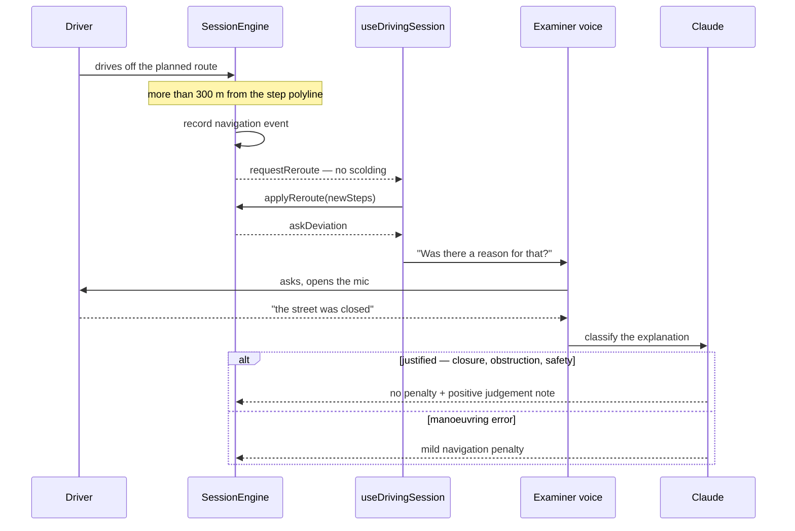

## What this is

I moved to New Zealand holding an overseas full licence, which means sitting the practical
test again on unfamiliar roads under unfamiliar rules. NZ Drive Practice is the app I built
out of that: a rehearsal of the full-licence test, end to end.

The driver mounts the phone and starts a session. For twenty minutes an AI examiner named
Sam directs them along a real route generated from their live location, asks them to
identify hazards and answer road-rule questions, monitors speed, stops and braking,
silently re-routes when they deviate, and closes with a verdict modelled on the official
NZTA assessment. The design goal is a session in which the phone is never touched at all,
and closing the remaining gap to that goal is the project's central open problem (see
Known limitations).

{/* IMAGE — cover / onboarding screen: "Pass your NZ practical test" with feature highlights */}
<ImageRow
  side="right"
  src="/images/portfolio/drive-nz-app/home.png"
  alt="Onboarding screen titled Pass your NZ practical test, listing live GPS routing, an AI voice examiner, and Road Code scoring"
  caption="Onboarding: the app frames itself as a full simulation of the NZ full-licence test."
>

The audience I had in mind is the one I belong to: drivers converting an overseas full
licence, a path a great many new residents walk. What they need is not more driving
practice. It is to find out what the examiner is watching for.

</ImageRow>

## Built with AI, on purpose

This project has two jobs, and I took both on deliberately.

The first is the one above: a real problem, taken from my own migration, with a user who is
not hypothetical because for several months it was me.

The second is that this is where I practise AI-assisted engineering under conditions I
control. My master's research asks what happens to professional craft when AI absorbs the
routine part of the work, and I did not want to answer that from reading alone. So I built
something with real constraints and used AI throughout, to find out first-hand what the
discipline costs and what it buys.

That is a different claim from "the product uses AI", which is also true and much cheaper to
make. Claude runs the examiner inside the app; Claude also helped write the app. The second
is the one worth interrogating, and it is why this is the project I hand over when someone
asks to see AI-assisted work.

It is not vibecoding, and the difference is checkable rather than rhetorical. Every
structural decision is captured in an ADR written at the moment of choosing, not
reconstructed afterwards. The roadmap advances through MVPs whose exit criteria are
falsifiable statements rather than aspirations. The exam logic sits in a pure engine covered
by 254 deterministic replay tests that run in about four seconds. Speed that leaves no
reasoning behind turns into a liability within a fortnight, and those three things are what
keep it from becoming one.

## The live drive

During a session the app runs a real, test-style route near the driver using live GPS. Sam speaks directions aloud and asks the driver to call hazards as they appear, mirroring the flow of an official assessment. A persistent session bar keeps the state visible and lets the driver end the session at any point.

{/* IMAGE 1 — live map during a drive, with voice prompt and "Session active" bar */}
{/*
<ImageRow
  side="left"
  src="/images/portfolio/drive-nz-app/home.png"
  alt="Live GPS map during a practice drive, with an AI examiner voice prompt and an active-session bar"
  caption="A live, dynamically re-routed drive with Sam speaking directions and an active-session control."
>

The route is not fixed. It is recalculated from the current GPS position whenever a leg is completed or the driver strays more than 300 metres off course, with a twenty-second debounce to avoid thrashing. Position itself is read from `MapView.onUserLocationChange` as the authoritative source, since `followsUserLocation` proved unreliable with the Google provider, with `watchPositionAsync` kept only as a fallback.

</ImageRow>
*/}

## When the driver goes off route

Getting lost is not what fails a driving test. Disobeying signs and markings is. I built the app to model that distinction rather than to penalise every wrong turn, which is what my first version did.

When the driver strays more than three hundred metres from the planned step, the engine records a navigation event and requests a reroute silently, with no reprimand. Only once the new route has been applied does the examiner ask what happened, and the driver answers by voice. Claude then classifies the explanation: a road closure, an obstruction, or a safety decision counts as justified, carries no penalty, and adds a positive note to the judgement, while anything else is treated as a manoeuvring error and keeps a mild penalty. If the AI cannot be reached the fallback is manoeuvring error, which is exactly the behaviour that existed before the flow was built, so an offline session loses nothing it previously had.



The road data behind the drive is real rather than inferred. At route build the app prefetches a corridor from OpenStreetMap via Overpass, with speed-limit zones, stop signs, traffic signals, give-way markings, and level and pedestrian crossings, and the engine evaluates them by GPS proximity. Traffic signals suppress the unexpected-stop and harsh-braking nudges, so queueing at a red light is not recorded as a fault.

## The debrief

After each session the app produces a feedback screen. The headline is a PASS or a FAIL, never a percentage, because that is the question a learner actually asks.

The verdict comes from the recorded events, read against the official NZTA error categories. Speeding of ten km/h or more over the limit counts as an immediate fail at any duration; so does five km/h or more sustained for five seconds, a stop sign taken without a complete stop, or a failure to give way. A brief five to ten km/h excess counts as critical instead. The session fails on a single immediate fail, or on more than one critical error.

```mermaid
flowchart LR
    subgraph recorded["Recorded during the drive"]
        speed["Speed violations"]
        stops["Stop / crossing events"]
        navev["Navigation deviations"]
        hazard["Hazard + knowledge answers"]
    end

    subgraph mapping["NZTA mapping"]
        imm["Immediate fail<br/>10+ km/h over, any duration<br/>5+ km/h over for 5 s<br/>no complete stop<br/>failure to give way"]
        crit["Critical<br/>brief 5–10 km/h over"]
        none["Not an error<br/>deviations, including justified ones"]
    end

    verdict{"Any immediate fail<br/>or more than one critical?"}
    fail["FAIL"]
    pass["PASS"]
    progress["Progress score<br/><i>secondary trend metric only</i>"]

    speed --> imm
    speed --> crit
    stops --> imm
    navev --> none
    hazard --> progress

    imm --> verdict
    crit --> verdict
    verdict -->|yes| fail
    verdict -->|no| pass

    classDef bad fill:var(--diagram-fail),stroke:var(--diagram-fail-line),color:var(--foreground)
    classDef good fill:var(--diagram-pass),stroke:var(--diagram-pass-line),color:var(--foreground)
    class fail,imm bad
    class pass good
```

Below the verdict the screen summarises the drive in plain language, notes what went well and what to improve, and breaks the performance down by category: hazard awareness, road rules knowledge, speed compliance, stop compliance, navigation and session completion. The live examiner runs on a fast conversational model while the final debrief is generated by a stronger one, so the summary reads like an examiner talking the driver through their result rather than a form being filled in. From there the app offers one clear next step: drive again, or go home.

The verdict is also explicit about its own limits. It states what it did not assess, mirror and head checks, signalling, lane position and vehicle control, none of which are observable from GPS and voice alone, so it can never be mistaken for a complete assessment. Alignment to the NZTA categories is a design intent, not a claim of official equivalence. A partial assessment that names its own blind spots is worth more to a nervous learner than a complete-looking one that quietly guesses.

{/* IMAGE 2 — session feedback: observations, areas to improve, per-category score breakdown */}
{/*
<ImageRow
  side="right"
  src="/images/portfolio/drive-nz-app/home.png"
  alt="Session feedback screen with observations, areas to improve, and a per-category score breakdown"
  caption="A structured debrief: narrative feedback plus a per-category score breakdown."
>

The scoring model is deliberately aligned to official NZTA categories, including critical errors and immediate-fail conditions, rather than an invented percentage (ADR-0005), so it can answer the question a learner actually asks: would I have passed. The numeric score is kept only as a secondary trend metric across sessions.

</ImageRow>
*/}

## Session history

Before starting a new session, the driver sees their past practice sessions, so progress is visible over time and each drive builds on the last rather than standing alone.

{/* IMAGE 3 — past-sessions screen, still to be captured. Once you have it, wrap the
    paragraph above in an <ImageRow side="left"> with the real src, alt and caption,
    the same way "The live drive" is set up. Until then the prose stands on its own
    so the heading is never empty on the published page. */}

## Architecture

The most important structural decision I made is captured in ADR-0006: I extracted the exam logic into a pure engine (`src/engine/`) with no React, Expo, globals, or clocks. It receives plain data, GPS fixes, injected timestamps, voice exchanges, and returns **commands** rather than performing actions. `useDrivingSession.ts` is the thin adapter that executes them against the device APIs, and it is the only layer that touches the outside world.

That boundary shows up in small, concrete ways. A `speak` command carries a priority, so a safety or navigation utterance interrupts whatever the examiner is saying while a coaching remark is dropped if speech is already playing. A `requestReroute` command is fetched by the adapter and handed back through `applyReroute`, which keeps the network out of the engine entirely. And because timestamps are injected rather than read from a clock, a session replays identically every time.

```mermaid
flowchart TB
    ui["<b>Screens</b> — expo-router<br/>login · home · session · feedback · history"]
    hooks["<b>Adapters</b> — React hooks<br/>useDrivingSession · useVoiceConversation<br/><i>owns GPS, speech, network, persistence</i>"]

    subgraph engine["Exam engine — pure TypeScript, no React and no I/O"]
        direction LR
        core["sessionEngine<br/>state + command emission"]
        monitor["monitoring<br/>speed · stops · braking"]
        nav["navigation<br/>instruction builders"]
        rec["recording<br/>event log"]
        score["scoring + nztaVerdict<br/>PASS/FAIL + progress score"]
    end

    ui <--> hooks
    hooks -->|"position, speed, speech"| core
    core -->|"commands"| hooks
    core --> monitor
    core --> nav
    core --> rec
    rec --> score

    classDef pure fill:var(--accent-soft),stroke:var(--color-accent),color:var(--foreground)
    class core,monitor,nav,rec,score pure
```

The trade-off is what makes this decision worth documenting. The logic used to live in a hook of around 370 lines, leaning on `useRef` to dodge stale closures and on module-level singletons. It worked, and it was close to untestable: jest-expo renders hooks, so the suite took roughly ten minutes, and resetting state between sessions was fragile. Separating the engine bought deterministic replay. A real GPS track plus a transcript now replays in a unit test in milliseconds, which is what lets me test exam logic without driving a car every time, and it is the piece that makes a later Android port (MVP-5) feasible by reusing the engine intact.

I keep the AI layer deliberately off the client. No provider key ships in the app: both the live examiner and the debrief, along with text to speech, go through a Supabase Edge Function proxy where the client authenticates with the user's own JWT and the server holds the keys and enforces a model allowlist. The backend is Supabase, with row-level security defined per operation and Google OAuth. Session state is checkpointed to Postgres every sixty seconds with idempotent upserts, so a crash at minute eighteen loses at most one minute of the drive.

## Process

The three guardrails are not decoration, and what they cost is recorded rather than smoothed over. Each ADR names the alternative I rejected and what I gave up by rejecting it. The MVP exit criteria are written before the work starts, so scope stays bounded and "done" is something checked rather than felt. And the deterministic replay tests mean the exam logic can be verified continuously, cheaply, and without a vehicle in the loop.

The fuller argument, decision by decision, is in the [case study](/case-studies/nz-drive-practice-case).

### Key decisions and their trade-offs

| ADR | Decision | Trade-off accepted |
| --- | --- | --- |
| 0001 | All AI calls go through a Supabase Edge Function proxy | One extra network hop (tens of ms) in exchange for never shipping API keys in the client bundle, a blocker for distribution via TestFlight |
| 0002 | Guest tier is fully ephemeral; nothing is persisted | Loses the option to migrate local progress into an account later, but avoids orphaned data and gives the simplest privacy story |
| 0003 | Full-duplex vs half-duplex audio strategy, pending a spike | Replaced a voice library that crashed on an `AVAudioPCMBuffer` exception with `expo-speech-recognition`, but true always-listening is still unresolved; it is tap-to-speak today, which contradicts the core hands-free constraint |
| 0004 | OSM / Overpass as the source of speed limits and checkpoints | Replaces a hardcoded 50 km/h limit and a sign-detection path that never fired, at the cost of an extra network call and imperfect data coverage in NZ |
| 0005 | Scoring aligned to official NZTA categories (critical errors / immediate fail) rather than an invented percentage score | Answers the user's real question ("would I have passed?") but requires maintaining an event-to-category mapping table by hand |
| 0006 | Pure, deterministic session engine | A large refactor cost, but it unlocks fast tests, replay, and Android portability |

### Known limitations (active technical debt)

Being candid about what is not done yet is part of the point. The largest gap between the product vision and the current code is that true hands-free is not implemented: the session is tap-to-speak today, which contradicts the central constraint, and I have deliberately blocked MVP-2 on the ADR-0003 spike rather than guess at it.

The exam itself is code complete but not yet field complete. Two MVP-1 exit criteria are still open because both need a real drive rather than a simulator: that a replayed real-drive GPS track produces identical event streams across runs, and that passing a mapped stop sign at fifteen km/h is recorded as a violation while a genuine full stop is recorded as compliant. Everything provable in a unit test has been proven. What remains needs a car.

Two smaller items sit behind those. OSM coverage in New Zealand is uneven, so the app falls back to instruction-text heuristics and a fifty km/h default whenever Overpass is unreachable or thin. And `simulate_drive.sh`, referenced in `CLAUDE.md`, does not actually exist in the repo; its replacement, a GPS route replayer, is scheduled for MVP-4.

### Roadmap status

Per `docs/ROADMAP.md`, with progress tracked through August 2026:

MVP-0, foundations, is complete: the AI proxy is in production with no extractable key in the bundle, the schema is at v2 with sixty-second checkpointing verified on device, false reroutes on long steps are fixed, and CI is green, running a typecheck and 254 tests across 16 suites in about four seconds, down from roughly ten minutes.

MVP-1, a credible exam, is code complete: the pure engine is extracted (ADR-0006), real OSM road data feeds the monitors (ADR-0004), deviations are classified as justified or manoeuvring errors, the NZTA-aligned verdict ships on the feedback screen (ADR-0005), and destinations are validated against the urban road network so a route never points at the sea. Two exit criteria remain open pending a real drive.

MVP-2, truly hands-free, is next and blocked on the ADR-0003 spike. MVP-3 (user tiers and progress history), MVP-4 (product quality, E2E and TestFlight), and MVP-5 (research and expansion) are planned.

## Stack

Frontend is React Native with Expo, using a dev client rather than Expo Go because of the native voice module. Maps use react-native-maps over Google Maps (`PROVIDER_GOOGLE`). Voice combines `expo-speech-recognition` for speech-to-text with OpenAI TTS, falling back to expo-speech. The backend is Supabase (Postgres with RLS and Google OAuth). The AI examiner runs on Claude Haiku for the live conversation and Claude Sonnet for the final debrief, both behind an Edge Function proxy rather than called directly from the client.